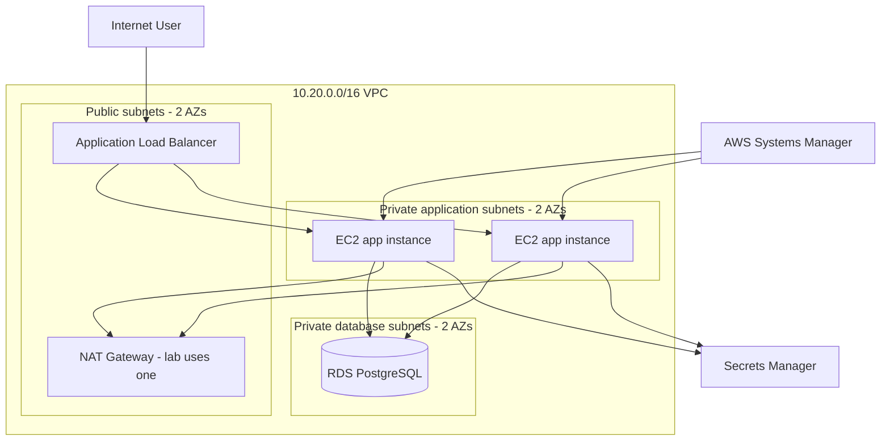

# Architecture

## Network boundaries

| Tier | Inbound source | Port | Public IP? |
|---|---|---:|---|
| ALB | Internet | 80, optionally 443 | Yes |
| EC2 app | ALB security group | 8000 | No |
| RDS | App security group | 5432 | No |

## Design decisions

### Why an ALB?
It creates a stable public endpoint, performs health checks, distributes requests, and lets the EC2 instances stay private.

### Why an Auto Scaling Group?
The application tier can replace failed instances automatically and scale horizontally.

### Why private application subnets?
Application servers do not need unsolicited inbound Internet access. Only the ALB should receive public application traffic.

### Why a NAT Gateway?
Private instances still need outbound access during bootstrap to install packages. The lab uses one NAT Gateway to reduce cost. A stronger production design typically places a NAT Gateway in each Availability Zone to avoid a cross-AZ dependency.

### Why Systems Manager instead of SSH?
No port 22 or SSH key distribution is required. Access is controlled by IAM and audited through AWS services.

### Why Secrets Manager-managed RDS credentials?
The password is generated and stored by AWS rather than hardcoded in Terraform variables, source control, user data, or outputs.

### Why S3 state locking instead of DynamoDB?
Modern Terraform S3 backends support native lockfiles through `use_lockfile = true`, while DynamoDB-based backend locking is deprecated.
